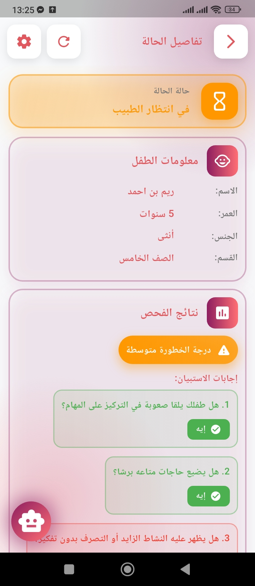

# 🧠 Mind Bloom

**ADHD (Attention Deficit Hyperactivity Disorder) Diagnostic & Care App**

<div align="center">
  
  <br>
  <strong>Helping You Understand Your Child Better</strong>
  <br><br>

[](https://flutter.dev/)
[](https://nodejs.org/)
[](https://www.mongodb.com/)

</div>

---

## 📖 About the Application

**Mind Bloom** is a comprehensive mobile application designed to facilitate early detection, diagnosis, and monitoring of ADHD in children. The platform bridges the gap between concerned parents and certified healthcare professionals, providing a seamless digital environment for ADHD assessment and care.

It connects parents with healthcare professionals, enabling:

* 🎥 **Behavioral analysis** through video submissions - Observe real-world child behavior
* 🩺 **Medical assessments** by certified doctors - Professional evaluation and diagnosis
* 💬 **Real-time communication** - Instant notifications and updates
* 📄 **Diagnostic reports** in PDF format - Comprehensive, downloadable medical reports
* 📊 **Continuous monitoring** and follow-up - Track progress over time

### 🎯 Objectives

* 🧠 **Early detection** via guided questionnaires - Identify potential ADHD symptoms early
* 🎥 **Behavioral observation** through video - Capture authentic behavioral patterns
* 🩺 **Professional diagnosis** by certified doctors - Ensure accurate medical evaluation
* 📊 **Case tracking** and report generation - Maintain comprehensive medical records
* 🌍 **Multi-language support** (EN / FR / AR) - Accessible to diverse communities
* 🎮 **Educational games** for concentration improvement - Therapeutic gaming activities
* 🌓 **Dark/Light mode** for visual comfort - Customizable user interface

---

## ✨ Key Features

### 👨‍👩‍👧 For Parents

* ✅ **Account creation and child profile management** - Securely store multiple child profiles
* 🤖 **AI-powered chatbot with guided screening** - Interactive ADHD assessment via Groq API
* 📊 **Automatic severity scoring** - Cases prioritized based on symptom severity (High 🔴 / Medium 🟠 / Low 🟢)
* 🎥 **Upload behavioral observation videos** - Share real-world behavioral footage with doctors
* 📤 **Submit cases to doctors** - Send complete assessment packages for professional review
* 🔔 **Receive additional test requests** - Get notified when doctors need more information
* 📋 **Receive final diagnosis with downloadable PDF** - Access comprehensive diagnostic reports
* 💬 **ADHD assistant chatbot via Groq API** - Get instant answers to ADHD-related questions
* 🌍 **Multi-language interface** (EN / FR / AR) - Switch between English, French, and Arabic seamlessly

### 🩺 For Doctors

* 🔐 **Secure login and personalized dashboard** - Protected access to patient information
* 📊 **Cases automatically sorted by severity** (High 🔴 / Medium 🟠 / Low 🟢) - Prioritize urgent cases
* 📁 **Access full case details** - View complete patient history, chatbot responses, and parent information
* 🎥 **Watch submitted videos** - Analyze behavioral patterns through video observations
* 📝 **Request customized additional tests** - Ask for specific assessments or information
* ✍️ **Write diagnoses and recommendations** - Create detailed medical evaluations
* 📤 **Send final conclusions to parents** - Deliver professional diagnostic reports with treatment recommendations

### 🎮 Concentration Games (4 Educational Games)

Mind Bloom includes four specially designed therapeutic games to help children with ADHD improve their attention span, focus, and cognitive skills:

**Game Features:**
* 🧩 **Memory Match Game** - Enhances visual memory and pattern recognition
* 🎯 **Focus Challenge** - Improves sustained attention and reaction time
* 📈 **Progress tracking** - Monitor improvement over time
* 🏆 **Motivating reward system** - Earn achievements and badges
* 🎮 **Age-appropriate difficulty levels** - Adaptive challenges for different skill levels
* 🌈 **Colorful, engaging interface** - Child-friendly design with smooth animations

### 🛠️ Technical Features

* 🔒 **JWT authentication with secure tokens** - Industry-standard security protocols
* 🔑 **Password hashing with Bcrypt** - Encrypted credential storage
* ✅ **Server-side input validation** - Comprehensive data validation and sanitization
* 🛡️ **CORS protection configured** - Secure cross-origin resource sharing
* 🌓 **Dark/Light mode support** - Reduces eye strain and improves accessibility
* 🔔 **Real-time notifications** - Instant updates on case status changes
* ☁️ **Cloud storage for videos** - Reliable video upload and streaming
* 🎨 **Modern UI/UX** (violet & white theme) - Professional, calming design aesthetic
* ✨ **Smooth animations** - Polished transitions and interactions
* 📱 **Responsive across all devices** - Optimized for phones and tablets

---

## 🎨 Application Design

### Color Theme

The application uses a carefully selected color palette designed to be calming and professional:

* **Primary:** Violet (#7B2CBF) - Represents wisdom, creativity, and mental wellness
* **Secondary:** White (#FFFFFF) - Provides clarity and cleanliness
* **Accent:** Light Purple - For highlights and interactive elements
* **Text:** Dark Violet / Black - Ensures optimal readability
* **Status Colors:**
  * 🔴 High Severity: Red
  * 🟠 Medium Severity: Orange
  * 🟢 Low Severity: Green

---

## 📱 Application Screens & Functionality

### 🌟 Getting Started

<div align="center">
  
  
  
  
</div>

The app begins with an animated splash screen featuring the Mind Bloom logo with a smooth fade-in effect, transitioning to educational carousel screens that introduce ADHD information and app features. These onboarding screens provide:

* **ADHD Overview** - Basic information about Attention Deficit Hyperactivity Disorder
* **App Features** - How Mind Bloom can help families
* **Getting Started** - Quick guide to using the application

An educational section provides valuable information about ADHD symptoms, diagnosis criteria, and treatment options, helping parents better understand the condition and available support resources.

### 🔐 Authentication Flow

<div align="center">
  
  
    
    
    
  
  
</div>

**Authentication Process:**

1. **Welcome Screen** - Users choose to login or create a new account
2. **Role Selection** - Select between Parent or Doctor account type
3. **Registration Forms:**
   * **Parent Registration** - Collects name, email, phone number, and password
   * **Doctor Registration** - Requires medical credentials, specialization, license number, and verification documents
4. **Login Interface** - Automatically detects user type based on credentials
5. **Security Features:**
   * JWT token-based authentication
   * Encrypted password storage with Bcrypt
   * Session management
   * Secure password reset functionality

All authentication is secured with industry-standard encryption and validation to protect sensitive medical information.

### 👨‍👩‍👧 Parent Experience

<div align="center">
  
  
  
  
  
  
  
  
  
  
</div>

**Parent Dashboard Features:**

* **Case Management** - View all submitted cases with color-coded severity indicators
* **Status Tracking** - Real-time updates on case progress (Pending, In Review, Additional Tests Requested, Diagnosed)
* **Child Profiles** - Manage multiple children with individual medical histories

**Creating a New Assessment:**

1. **Child Information Entry:**
   * Full name
   * Date of birth / Age
   * Gender
   * School grade level
   * Medical history notes

2. **AI Chatbot Screening** - Interactive questionnaire covering:
   * Attention and focus patterns
   * Hyperactivity indicators
   * Impulsivity behaviors
   * Social interactions
   * Academic performance
   * Sleep patterns and routines

3. **Automatic Severity Calculation:**
   * **High (🔴)** - Severe symptoms requiring immediate attention
   * **Medium (🟠)** - Moderate symptoms needing professional evaluation
   * **Low (🟢)** - Mild symptoms for routine assessment

4. **Video Upload** - Record and submit behavioral observation videos (supports multiple formats, up to 100MB)

5. **Case Submission** - Send complete assessment package to doctors for review

**Ongoing Case Management:**

* **Receive Notifications** - Alerts for doctor responses, test requests, and diagnoses
* **View Diagnosis** - Access final medical evaluation with recommendations
* **Download PDF Reports** - Save comprehensive diagnostic documents for medical records
* **Edit Cases** - Update information before doctor review

#### 🤖 Chatbot Screening

Intelligent chatbot powered by Groq API, conducts a comprehensive ADHD through natural conversation.

<div align="center">
  
  
  
  
  
  
  
  
</div>


### 🎮 Concentration Games

Mind Bloom includes four games to help children with ADHD develop crucial cognitive skills:
<div align="center">
  
  
  
  
  
  
  
  
  
  
  
  
  
  
  
</div>

**Game Benefits:**
* 📈 **Progress Tracking** - Monitor skill improvement over time
* 🏆 **Achievement System** - Unlock badges and rewards
* 📊 **Performance Statistics** - View detailed gameplay analytics
* 🎯 **Adaptive Difficulty** - Games adjust to child's skill level
* ⏱️ **Session Management** - Recommended play durations to prevent overstimulation

### 🩺 Doctor Experience

<div align="center">
  
  
  
  
  
  
  
  
  
  
</div>

**Doctor Dashboard Features:**

* **Prioritized Case Queue** - Cases automatically sorted by severity:
  * 🔴 **High Priority** - Severe cases requiring immediate attention
  * 🟠 **Medium Priority** - Moderate cases for timely review
  * 🟢 **Low Priority** - Routine assessments

* **Comprehensive Case View:**
  * Complete child profile and medical history
  * Parent contact information
  * Full chatbot questionnaire responses
  * Behavioral observation videos with playback controls
  * Previous medical records (if available)
  * Timeline of case activities

**Doctor Actions:**

1. **Request Additional Tests:**
   * Specify required assessments or information
   * Provide clear instructions to parents
   * Set deadlines for submissions
   * Track test completion status

2. **Provide Diagnosis:**
   * **Diagnostic Conclusion** - ADHD type classification (Predominantly Inattentive, Predominantly Hyperactive-Impulsive, Combined Type)
   * **Severity Assessment** - Mild, Moderate, or Severe
   * **Medical Notes** - Detailed clinical observations
   * **Recommendations** - Treatment options, therapy suggestions, medication if appropriate
   * **Follow-up Plan** - Monitoring schedule and next steps
   * **Lifestyle Advice** - Educational, dietary, and behavioral recommendations

3. **Generate Reports:**
   * Automatically formatted PDF diagnostic reports
   * Professional medical document formatting
   * Includes all relevant case information
   * Digitally signed by doctor
   * Instantly delivered to parent with notification

**Notification System:**
* New case assignments
* Parent responses to test requests
* Case updates and changes
* Urgent priority cases

### ⚙️ Additional Features

<div align="center">
  
</div>

**Settings & Customization:**

* **Appearance:**
  * 🌓 **Dark/Light Mode Toggle** - Reduce eye strain with dark theme

* **Language Selection:**
  * 🇬🇧 **English** - Full interface translation
  * 🇫🇷 **French** - Complete French localization
  * 🇹🇳 **Arabic** - Right-to-left Arabic support

---

## 📁 Project Structure

```
mind-bloom/
├── frontend/                 # Flutter mobile app
│   ├── lib/
│   │   ├── constants/       # App-wide constants and configuration
│   │   ├── models/          # Data models (User, Case, Child, etc.)
│   │   ├── providers/       # State management with Provider
│   │   ├── screens/         # All application screens
│   │   │   ├── auth/        # Authentication screens
│   │   │   ├── parent/      # Parent-specific screens
│   │   │   ├── doctor/      # Doctor-specific screens
│   │   │   ├── chatbot/     # AI chatbot interface
│   │   │   └── settings/    # Settings and preferences
│   │   ├── services/        # API communication services
│   │   ├── widgets/         # Reusable UI components
│   │   ├── games/           # 4 concentration games
│   │   ├── i18n/            # Internationalization files
│   │   └── main.dart        # Application entry point
│   ├── assets/
│   │   ├── images/          # Images, icons, and logo
│   │   ├── animations/      # Lottie animations
│   │   └── translations/    # JSON language files (en, fr, ar)
│   └── pubspec.yaml         # Flutter dependencies
│
├── backend/                 # Node.js/Express API server
│   ├── models/              # MongoDB/Mongoose models
│   │   ├── User.js          # User model (Parent/Doctor)
│   │   ├── Child.js         # Child profile model
│   │   ├── Case.js          # Case/assessment model
│   │   └── Notification.js  # Notification model
│   ├── routes/              # Express API routes
│   │   ├── auth.js          # Authentication routes
│   │   ├── cases.js         # Case management routes
│   │   ├── users.js         # User profile routes
│   │   └── notifications.js # Notification routes
│   ├── controllers/         # Business logic controllers
│   ├── middleware/          # Authentication & validation middleware
│   │   ├── auth.js          # JWT verification
│   │   └── validation.js    # Input validation
│   ├── config/              # Configuration files
│   │   ├── database.js      # MongoDB connection
│   │   └── jwt.js           # JWT configuration
│   ├── services/            # External service integrations
│   │   ├── groqService.js   # Groq AI API integration
│   │   └── pdfService.js    # PDF report generation
│   ├── uploads/             # Video and file storage
│   ├── utils/               # Utility functions
│   └── server.js            # Express server entry point
│
├── screenshots/             # Application screenshots for documentation
│   ├── welcome/            # Onboarding screens
│   ├── auth/               # Authentication screens
│   ├── parent/             # Parent interface screenshots
│   ├── doctor/             # Doctor interface screenshots
│   ├── chatbot/            # Chatbot conversation screenshots
│   ├── game/               # Game screenshots
│   └── notifications.jpg   # Notification examples
│
└── README.md               # Project documentation
```

---

## 🚀 Installation

### Prerequisites

Before you begin, ensure you have the following installed:

- **Node.js** 22.x or higher - [Download](https://nodejs.org/)
- **Flutter** 3.35 or higher - [Installation Guide](https://flutter.dev/docs/get-started/install)
- **MongoDB** 8.2 or higher - [Download](https://www.mongodb.com/try/download/community)
- **Groq API** account - [Sign up](https://console.groq.com/) for AI chatbot functionality
- **Android Studio** or **Xcode** - For mobile app development
- **Git** - For version control

### Backend Setup

1. **Clone the repository:**

```bash
git clone https://github.com/yourusername/mind-bloom.git
cd mind-bloom/backend
```

2. **Install dependencies:**

```bash
npm install
```

3. **Edit the `.env` file with your configuration:**

```env
# Server Configuration
PORT=5000
NODE_ENV=development

# Database
MONGODB_URI=mongodb://localhost:27017/mindbloom

# Authentication
JWT_SECRET=your_super_secret_jwt_key_here_min_32_characters
JWT_EXPIRE=7d

# Groq AI API (for chatbot)
GROQ_API_KEY=your_groq_api_key_here
```

4. **Run the backend server:**

```bash
# Development mode with auto-reload
npm run dev

# Production mode
npm start
```

The backend API will be running at `http://localhost:5000`

### Frontend Setup

1. **Navigate to frontend directory:**

```bash
cd mind-bloom/frontend
```

2. **Install Flutter dependencies:**

```bash
flutter pub get
```

3. **Check available devices:**

```bash
flutter devices
```

4. **Run the application:**

```bash
# Run on default device
flutter run

# Run on specific device
flutter run -d <device_id>

# Run in release mode for better performance
flutter run --release
```
---

## 🌍 Multi-language Support

The application supports 3 languages with complete interface translation:

* 🇹🇳 **Tunisian Arabic** Default language
* 🇬🇧 **English**
* 🇫🇷 **French**

**Language Switching:**
Users can change the application language anytime through Settings → Language → Select preferred language. The interface updates instantly without requiring app restart.

---

## 🔒 Security Features

* **JWT Authentication** - Secure token-based authentication
* **Password Encryption** - Bcrypt hashing with salt rounds
* **Input Validation** - Server-side validation of all inputs
* **SQL Injection Prevention** - Parameterized queries with Mongoose
* **Secure File Upload** - File type and size validation

---

## 🙏 Acknowledgments

* **Groq AI** - For powerful AI chatbot capabilities
* **Flutter Team** - For the excellent cross-platform framework
* **MongoDB** - For reliable database solutions
* **Medical Consultants** - For ADHD assessment guidance

---

<div align="center">
  <strong>Made with ❤️ for children and families</strong>
  <br>
  <sub>Mind Bloom © 2025 - All rights reserved</sub>
  <br><br>
  <em>"Empowering families through early detection and expert care"</em>
</div>