
 
  🧠 Mind Bloom 
  ADHD (Attention Deficit Hyperactivity Disorder) Diagnostic & Care App

  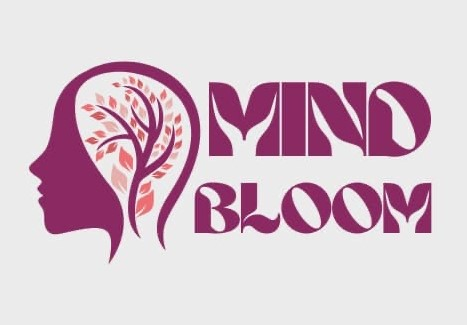
   
  <strong>Helping You Understand Your Child Better</strong>
    

---

## About the Application

**Mind Bloom** is a mobile application designed to facilitate early detection, diagnosis, and monitoring of ADHD in children.

It connects parents with healthcare professionals, enabling:

* 🤖 **AI-based preliminary screening**
* 🎥 **Behavioral analysis** through video submissions
* 🩺 **Medical assessments** by certified doctors
* 💬 **Real-time communication**
* 📄 **Diagnostic reports** in PDF format
* 📊 **Continuous monitoring** and follow-up

### Objectives

* 🧠 **Early detection** via guided questionnaires
* 🎥 **Behavioral observation** through video
* 🩺 **Professional diagnosis** by certified doctors
* 📊 **Case tracking** and report generation
* 🌍 **Multi-language support** (EN / FR / AR)
* 🎮 **Educational games** for concentration improvement
* 🌓 **Dark/Light mode** for visual comfort

---

## ✨ Key Features

### 👨‍👩‍👧 For Parents

* ✅ Account creation and child profile management
* 🤖 AI-powered chatbot with guided screening
* 📊 Automatic severity scoring
* 🎥 Upload behavioral observation videos
* 📤 Submit cases to doctors
* 🔔 Receive additional test requests
* 📋 Receive final diagnosis with downloadable PDF
* 💬 ADHD assistant chatbot via Groq API
* 🌍 Multi-language interface (EN / FR / AR)

### 🩺 For Doctors

* 🔐 Secure login and personalized dashboard
* 📊 Cases automatically sorted by severity (High 🔴 / Medium 🟠 / Low 🟢)
* 📁 Access full case details
* 🎥 Watch submitted videos
* 📝 Request customized additional tests
* ✍️ Write diagnoses and recommendations
* 📤 Send final conclusions to parents

### 🎮 Concentration Games (4 Games)

* 🧩 Designed to improve attention and focus
* 🎯 Adapted for children with ADHD
* 📈 Progress tracking
* 🏆 Motivating reward system

### 🛠️ Technical Features

* 🔒 JWT authentication with secure tokens
* 🔑 Password hashing with Bcrypt
* ✅ Server-side input validation
* 🛡️ CORS protection configured
* 🌓 Dark/Light mode support
* 🔔 Real-time notifications
* ☁️ Cloud storage for videos
* 🎨 Modern UI/UX (violet & white theme)
* ✨ Smooth animations
* 📱 Responsive across all devices

---

## 🎨 Application Design

### Color Theme

* **Primary:** Violet (#7B2CBF)
* **Secondary:** White (#FFFFFF)
* **Text:** Dark Violet / Black

---

## 📱 Application Screens & Functionality

### Getting Started

  
  
  
  

The app begins with an animated splash screen featuring the Mind Bloom logo, transitioning to educational carousel screens that introduce ADHD information and app features. An educational section provides valuable information about ADHD, helping parents better understand the condition and available support resources.

### 🔐 Authentication Flow

  
  
    
    
  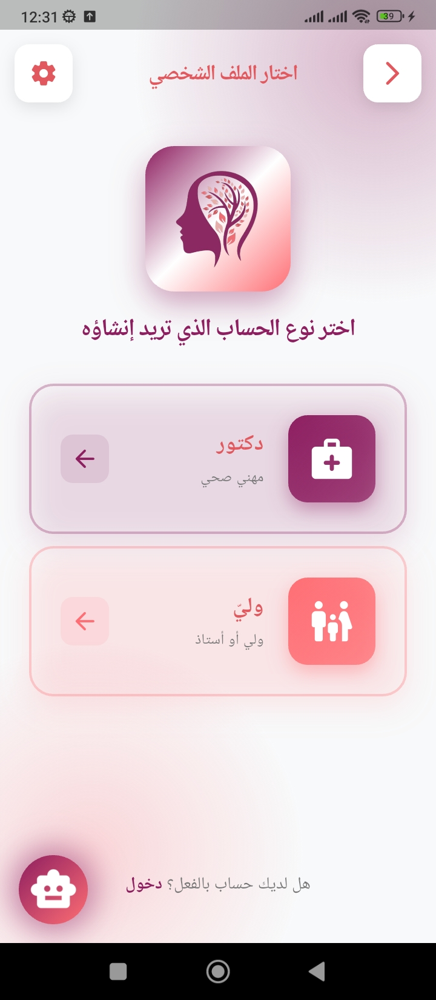  
  
  

Users then reach the welcome screen where they can choose to login or create a new account. The login interface automatically detects user type (Parent or Doctor) based on credentials, while the registration flow allows profile selection with customized forms for each user type. All authentication is secured with JWT tokens and encrypted password storage.

### 👨‍👩‍👧 Parent Experience
Parents access a personalized dashboard displaying all their submitted cases with real-time status tracking. To initiate a new assessment, they enter their child's information including name, age, gender, and school grade. The AI-powered chatbot then conducts an interactive screening session with guided ADHD-related questions, automatically calculating a severity score based on responses to determine case priority.

  
  
  
  
  
  
  
  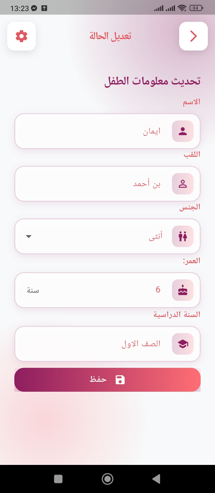
  

  
  
  
  
  
  
  
  

After completing the questionnaire, parents upload a behavioral observation video of their child. The system generates a comprehensive case summary including child information, chatbot answers, and video for submission to doctors. Parents can track all their cases, receive notifications when doctors request additional tests or provide diagnoses, and download final diagnostic reports in PDF format.

  #### Chatbot Screening

  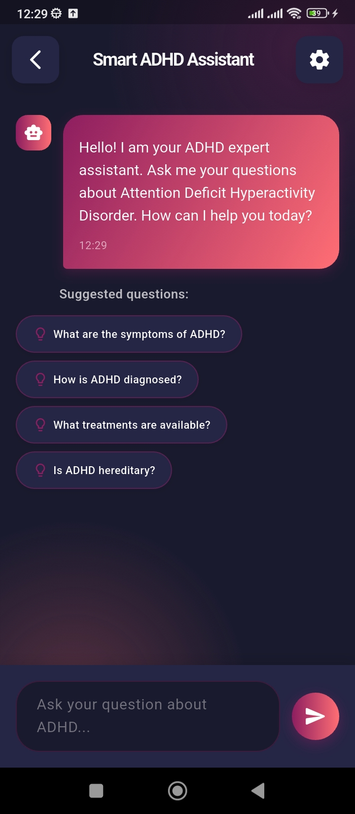
  
  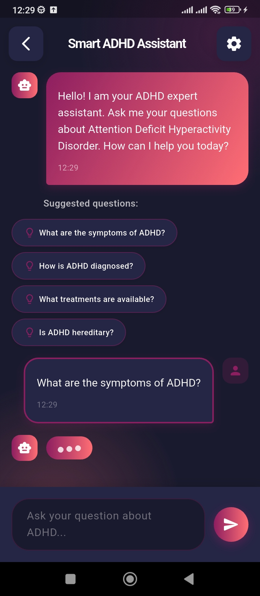
  
  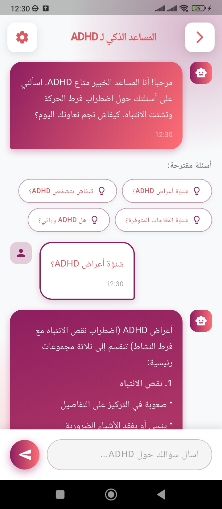
  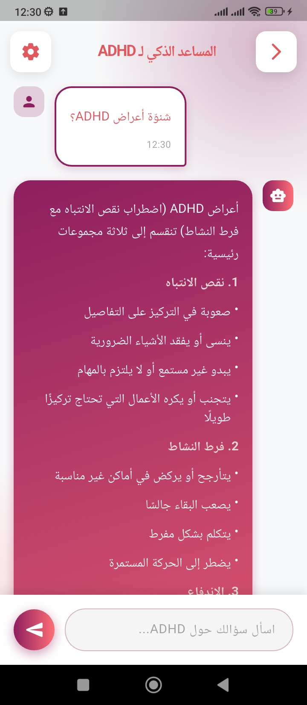
  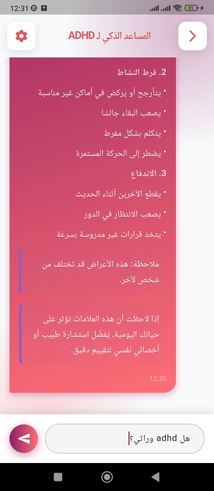
  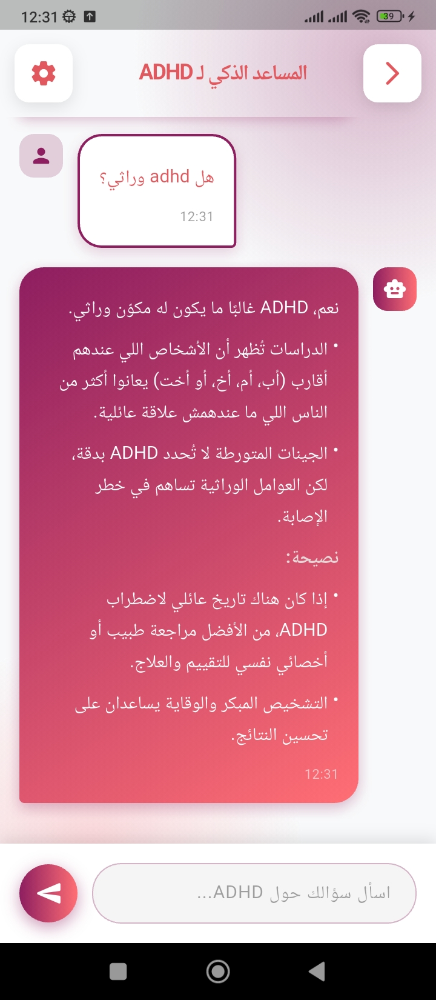

### Games

  
  
  
  
  
  
  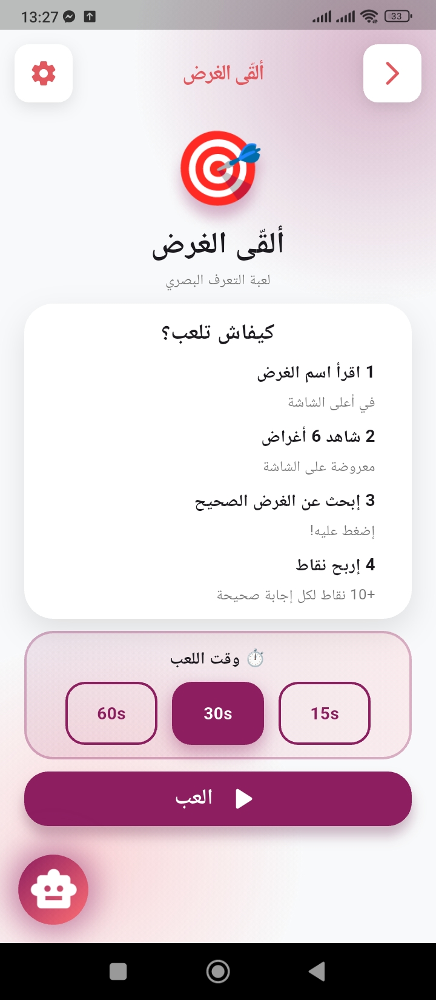
  
  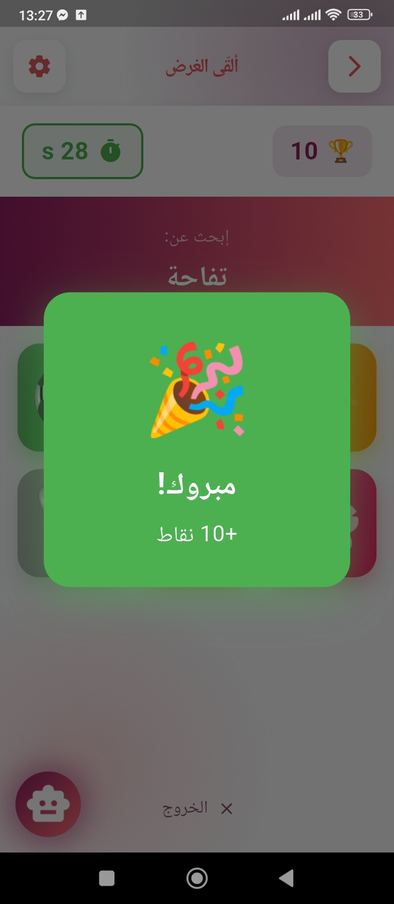
  
  
  
  
  
  

### 🩺 Doctor Experience
Doctors access a specialized dashboard where cases are automatically prioritized and color-coded by severity: High (🔴), Medium (🟠), and Low (🟢). Each case provides complete access to child profiles, parent information, chatbot screening responses, and behavioral videos. Doctors can either request additional customized tests with specific instructions or provide a final diagnosis. The diagnostic interface allows doctors to write detailed conclusions, medical notes, and recommendations, which are automatically formatted into professional PDF reports and delivered to parents with instant notifications.

  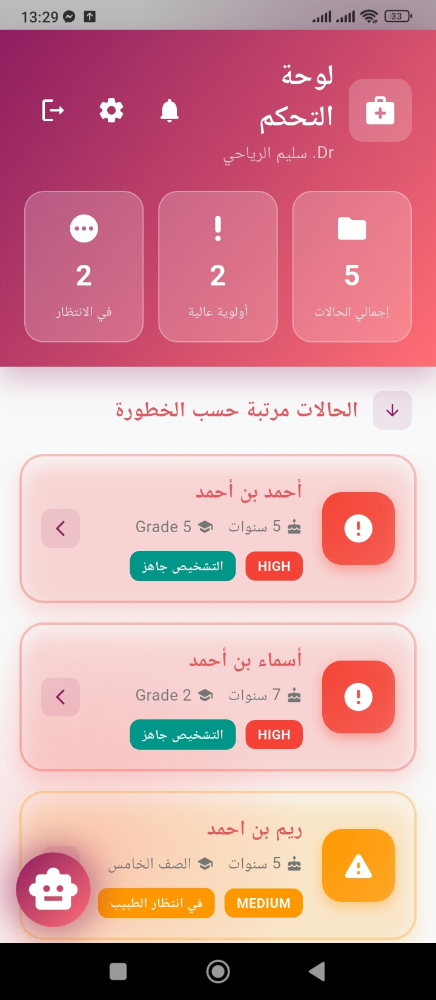
  
  
  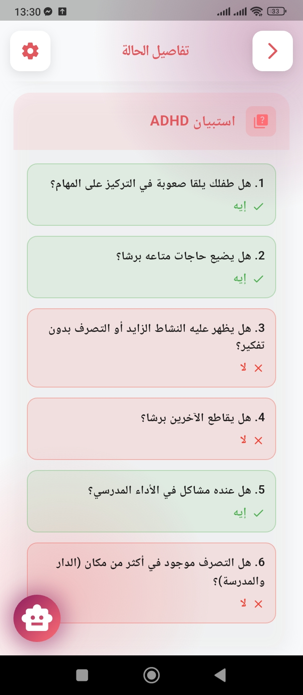
  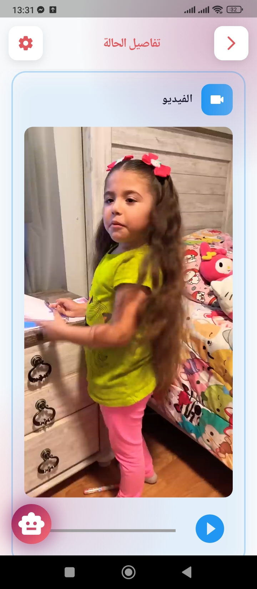
  
  
  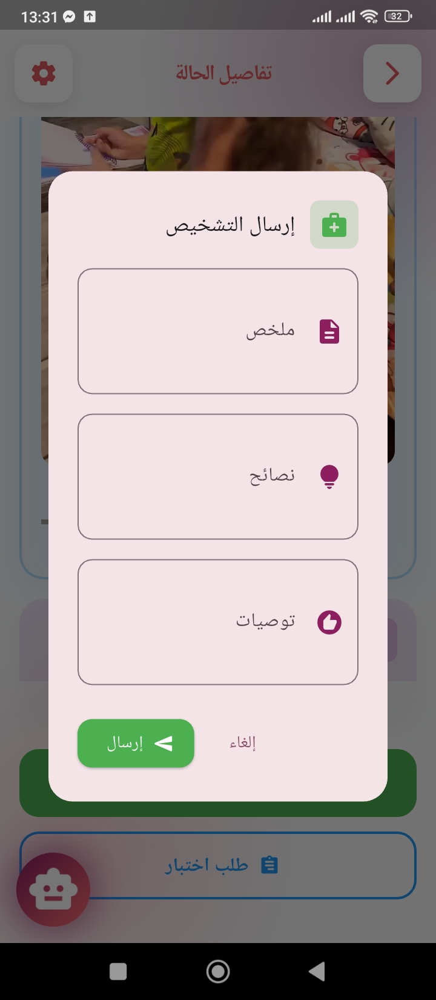
  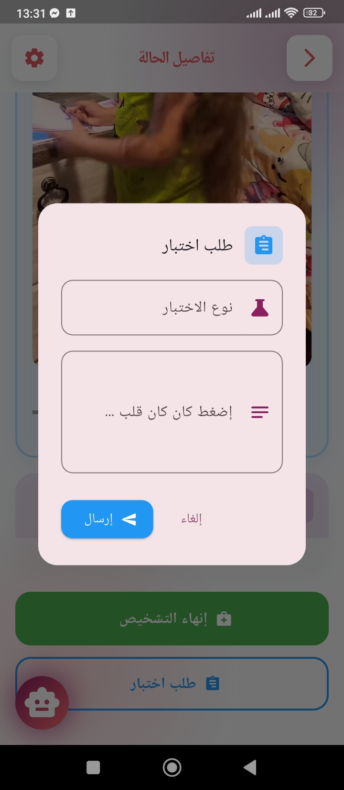
  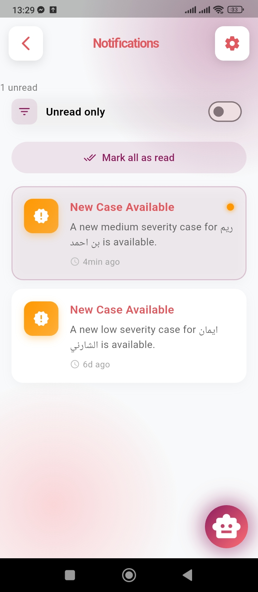

### ⚙️ Additional Features

  
  

The application includes a comprehensive notification system that alerts users in real-time about case updates, doctor responses, and test requests. Settings allow users to customize their experience with dark/light mode toggle, language selection (English, French, Arabic).

The application includes a comprehensive notification system that alerts users in real-time about case updates, doctor responses, and test requests. Settings allow users to customize their experience with dark/light mode toggle, language selection (English, French, Arabic) and profile management. An educational section provides valuable information about ADHD, helping parents better understand the condition and available support resources.

---

## 📁 Project Structure

mind-bloom/
├── frontend/                 # Flutter mobile app
│   ├── lib/
│   │   ├── constants/       # Constants and configuration
│   │   ├── models/          # Data models
│   │   ├── providers/       # State management
│   │   ├── screens/         # Application screens
│   │   ├── services/        # API services
│   │   ├── widgets/         # Reusable components
│   │   ├── games/           # 4 concentration games
│   │   ├── i18n/            # Translation files
│   │   └── main.dart        # Entry point
│   ├── assets/
│   │   ├── images/          # Images and logo
│   │   └── translations/    # Language files
│   └── pubspec.yaml
│
├── backend/                 # Node.js API
│   ├── models/              # MongoDB models
│   ├── routes/              # API routes
│   ├── controllers/         # Business logic
│   ├── middleware/          # Auth & validation
│   ├── config/              # Configuration
│   ├── services/            # Services (Groq API)
│   ├── uploads/             # Video storage
│   └── server.js            # Express server
│
├── screenshots/             # Application screenshots
└── README.md                # Documentation

---

## 🚀 Installation

### Prerequisites

- Node.js 22.x or higher
- Flutter 3.35 or higher
- MongoDB 8.2 or higher
- Groq API account (for AI chatbot)

### Backend Setup

bash
git clone https://github.com/yourusername/mind-bloom.git
cd mind-bloom/backend
npm install
cp .env.example .env

Edit .env:

env
PORT=5000
MONGODB_URI=mongodb://localhost:27017/mindbloom
JWT_SECRET=your_super_secret_jwt_key
NODE_ENV=development
GROQ_API_KEY=your_groq_api_key_here

Run server:

bash
npm run dev

### Frontend Setup

bash
cd mind-bloom/frontend
flutter pub get

Configure API endpoint in lib/constants/app_constants.dart:

dart
static const String baseUrl = 'http://localhost:5000/api';

Run app:

bash
flutter devices
flutter run

---

## 🌍 Multi-language Support

The application supports 3 languages:

* 🇬🇧 **English**
* 🇫🇷 **French**
* 🇹🇳 **Tunisian Arabic**

---

  <strong>Made with ❤️ for children and families</strong>
   
  Mind Bloom © 2025 - All rights reserved

